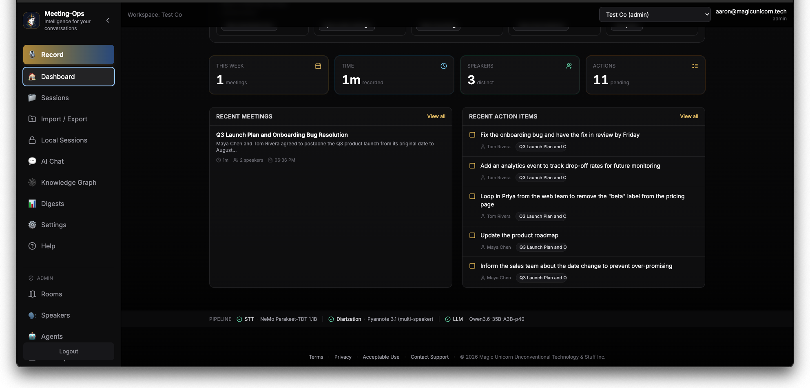
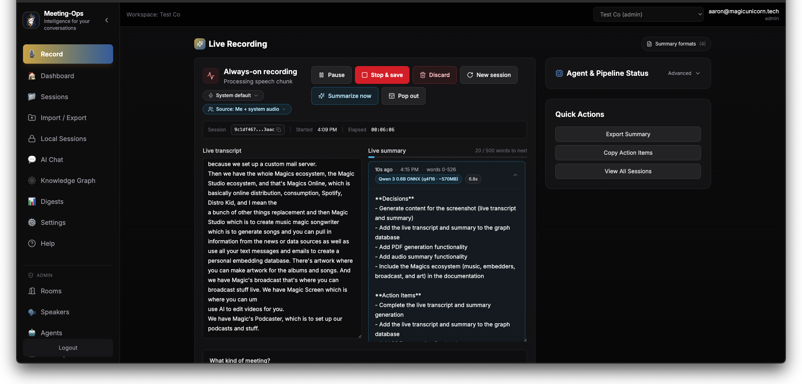
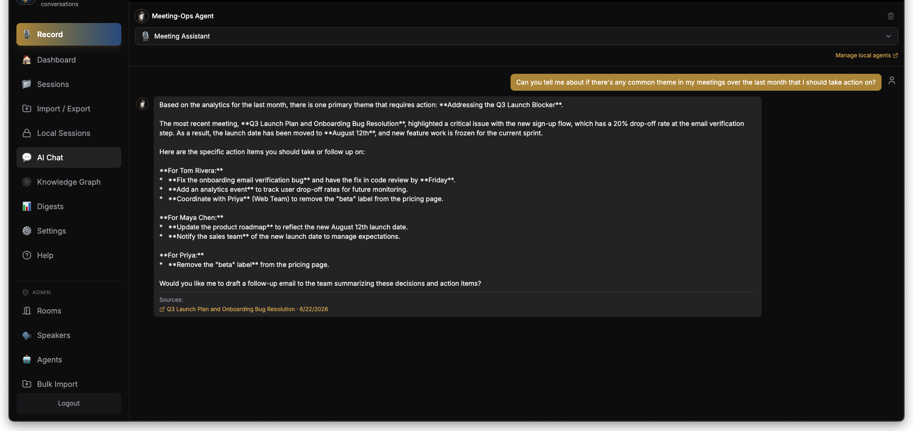
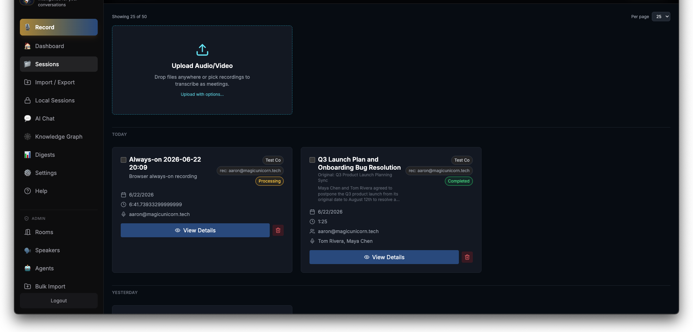
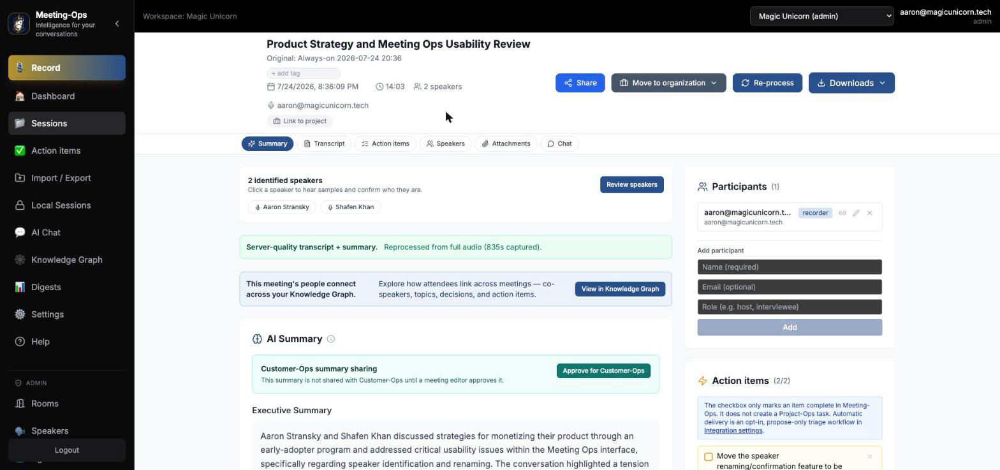
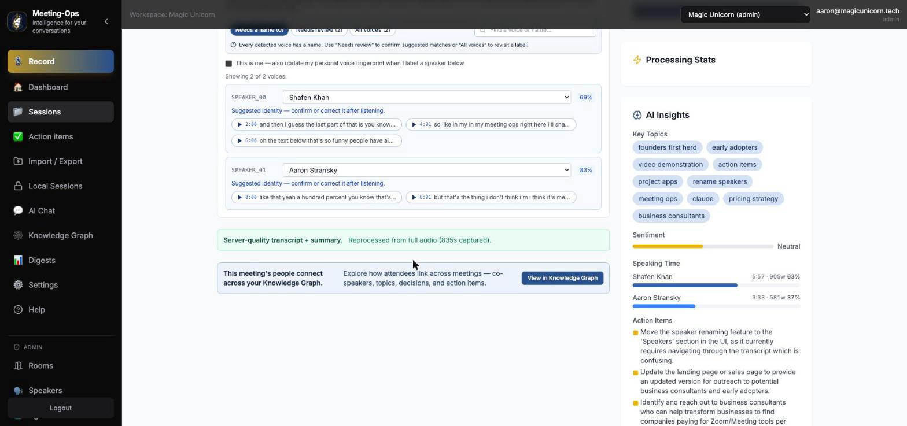

<div align="center">

# 🦄 Meeting-Ops

### The open standard for conversation intelligence.

**Record. Transcribe live. Know who said what. Get AI summaries & action items. Search every meeting you've ever had. Export anything.**
**Open source. No data harvesting. No third-party AI. Host it with us — or run it entirely yourself.**

<br/>

[](./CHANGELOG.md)
[](https://apps.apple.com/us/app/meeting-ops/id6780018348)
[](https://python.org)
[](https://react.dev)
[](https://fastapi.tiangolo.com)
[](#-browser-first-by-design)
[](#-privacy-ownership--control)
[](LICENSE)
[](LICENSE)

*Part of the [Unicorn Commander](https://git.unicorncommander.ai) suite.*

<br/>



</div>

---

## ✨ TL;DR

Most meeting-AI tools (Otter, Granola, Fathom, Fireflies, Read.ai) run your transcription and summarization on a vendor's GPUs and pipe your audio out to third-party AI — billed *per audio-minute* and *per token*, *per user*, continuously. Your conversations live on their servers and can be used to train their models.

**Meeting-Ops is built differently.** The live transcript and live summary run **in your browser** on small on-device models. The high-quality pass runs **once, at meeting end**, on GPUs *we* operate — never a third-party AI — or on *your* hardware if you self-host. Either way: **no per-audio-minute meter, no third-party AI, and your data is never harvested or used for training** — plus a privacy mode where the audio bytes never leave the device. It's open source, so you can verify every word of that, or run the whole thing yourself.

| | Meeting-Ops | Typical cloud meeting-AI |
|---|---|---|
| Live transcription | 🟣 In your browser (Parakeet) | ☁️ Vendor GPU, per-minute |
| Live summary | 🟣 In your browser (small LLM) | ☁️ Vendor tokens, per-minute |
| Final quality pass | 🟣 Once — our GPU, or yours (self-host) | ☁️ Continuous |
| Your audio sent to third-party AI | 🟣 **Never** (we run our own models) | ☁️ Usually (OpenAI / AssemblyAI / …) |
| Trained on your data | 🟣 **Never** | ⚠️ Often |
| Where it runs | 🟣 Our cloud · your private cloud · air-gapped on-prem | ☁️ Their cloud only |
| Speaker identity across meetings | 🟣 Persistent, self-improving | ⚠️ Usually per-meeting |
| Source code | 🟣 **Open source** (auditable) | ❌ Closed |

---

## 🎬 What it does

<table>
<tr>
<td width="50%" valign="top">

### 🔴 Record & transcribe
Hit record in the browser. Live transcription streams as you talk — mic, system audio, multi-mic conference rooms, satellite devices, or a desktop companion app. Always-on mode auto-segments your day into meetings.

</td>
<td width="50%" valign="top">

### 🧠 Understand
Live rolling summary while you meet; a polished final summary, action items, decisions, and attendees the moment you stop. Per-meeting AI chat ("what did we decide about pricing?") and a person-centric Knowledge Graph.

</td>
</tr>
<tr>
<td width="50%" valign="top">

### 🗣️ Know who said what
Speaker diarization + **persistent speaker identity**: every voice gets a stable identity that carries across meetings. Name someone once and it's fixed in *every* past meeting — instantly. (More below — it's the good part.)

</td>
<td width="50%" valign="top">

### 🔎 Recall everything
Full-text + hybrid semantic search across every meeting. Cross-meeting RAG ("summarize everything we've said about Acme this quarter"). Export to PDF / DOCX / TXT / SRT / JSON / Markdown.

</td>
</tr>
</table>

<div align="center">

| Live recording | Cross-meeting AI chat | Session manager |
|:--:|:--:|:--:|
|  |  |  |

| Meeting summary, actions & Project-Ops handoff | Speaker intelligence — identify, confirm, and see who spoke |
|:--:|:--:|
|  |  |

</div>

---

## 🛡️ Browser-first by design

> The thing that makes Meeting-Ops different isn't the model selection or the UI. **It's that we don't run the per-minute compute. The user's browser does.**

```
┌──────────────────── BROWSER · live work · free to us · runs all meeting ────────────────────┐
│                                                                                              │
│   🎙  Mic ─► VAD (Silero) ─► Parakeet 0.6B INT8 ───────────────► live transcript            │
│                              (onnxruntime-web · WebGPU/WASM)                                  │
│                                                                                              │
│                           ─► small on-device LLM (transformers.js / web-llm) ─► live summary │
│                                                                                              │
│   MediaRecorder ─► 30s WebM/Opus chunks ───────────────┐   uplink ≈ 28 MB/hr                │
│                                                          │                                    │
└──────────────────────────────────────────────────────────┼──────────────────────────────────┘
                                                           │  POST /audio-chunks (every 30s)
                                                           ▼
┌──────────── SERVER · runs ONCE at completion · ~30–90s · idle ecosystem GPU ────────────────┐
│                                                                                              │
│   ffmpeg reassemble ─► Parakeet 1.1B  ──────────────────► word-timestamped transcript        │
│                     ─► pyannote diarization + wespeaker ─► diarized + speaker-matched         │
│                     ─► Qwen 3.6 35B-A3B-Vision (MoE) ───► final summary · actions · attendees │
│                     ─► Infinity (bge-m3) ───────────────► indexed for cross-meeting search    │
│                                                                                              │
└──────────────────────────────────────────────────────────────────────────────────────────────┘
```

The browser stack runs in the tab for the entire meeting. The server stack runs **exactly once** when the meeting ends.

**Why it matters to you:** typical meeting-AI streams your audio to AssemblyAI/Deepgram per minute and OpenAI/Anthropic per token, continuously — your conversation rides along to those third parties the whole time. Browser-first changes the math: the per-minute work happens on the user's own device, so the only server cost is one ~30–90s burst per *finished* meeting. That's what lets us host it **privately and affordably** — no third-party AI, no per-minute meter — and lets you **self-host the whole thing on modest hardware**.

📖 Architecture deep-dive: [`docs/compute-economics.md`](./docs/compute-economics.md). *Default new features to browser-side compute; only fold work into the completion pass when quality genuinely requires it, and only reach for an external API as a flagged last resort.*

---

## 🗣️ Speaker intelligence (the good part)

Meeting-Ops doesn't just split a meeting into "Speaker 1 / Speaker 2." It builds a **persistent, self-improving identity** for every voice — and naming a person is a one-time, instant act.

- **Persistent identity across meetings.** When a voice matches no one yet, Meeting-Ops auto-creates a *stable* profile with a durable handle (e.g. `Speaker 3F2A`) instead of a throwaway label. The same voice matches the same profile in the *next* meeting — so people accrue history before you've ever named them.
- **Name once, fixed everywhere — instantly.** The display name is rendered **live** from each person's profile at read time (via the session's speaker links), so renaming a speaker updates *every* past transcript immediately, with **no re-processing**. A rename is a single profile-row update — it doesn't rewrite a single transcript. *(This is the v3.44 → v3.45 architecture: the name lives in exactly one place.)*
- **Confirming is safe (anti-poisoning).** Correcting or confirming a speaker teaches the system that voice — but a **consistency floor** means a mislabeled or mixed-voice segment can't corrupt a saved voiceprint. Confirming only ever improves accuracy.
- **Browser = full quality.** Recording in the browser now runs the *same* full transcription + diarization + identification pipeline as uploading a file. No quality penalty for staying in the tab.

🔧 Deep dive: [`docs/speaker-intelligence-design.md`](./docs/speaker-intelligence-design.md) — data model, identification math, the enrollment floor, and the dynamic-rendering single-source-of-truth.

---

## 🔒 Privacy, ownership & control

- **No third-party AI — ever.** Every model (STT, diarization, LLM, embeddings, TTS) runs on infrastructure *we* operate — or *yours*, self-hosted — behind a self-hosted LiteLLM gateway. Your conversations are never shipped to OpenAI / Anthropic / AssemblyAI, and **never used to train anyone's model.** It's the one promise the cloud meeting-AI category structurally can't make.
- **Your data is yours.** You own your meetings and transcripts; retention is configurable; and "delete my data" actually deletes — purging the audio objects (Garage), the search vectors (Qdrant), *and* the chat history.
- **Privacy mode.** A per-session toggle that keeps the entire pipeline in the browser — **audio bytes never leave the device.** Orthogonal to pricing; enterprise/HIPAA deployments default it on.
- **Run it your way.** Our hosted cloud (zero setup), your own private cloud, or a fully **air-gapped on-prem** appliance. The strictest buyers get complete data residency; everyone else gets one-click hosting.
- **Open source.** Auditable end to end — no black box, no lock-in. Verify the privacy claims yourself, or fork it and run the whole stack.
- **SSO-native + hardened.** Forward-auth trust boundary, per-workspace billing, WebSocket handshake auth, HTTP security headers, per-room retention controls.

---

## 🔗 Works with the rest of the suite

Meeting-Ops isn't an island — a meeting is where customer history and project work
*originate*. Two federations ship today, and both are governed rather than automatic.

### 👥 Contact-Ops / Customer-Ops — meetings become customer history

Meetings are projected into federated cockpits behind a **signed, cursor-paginated read
API**, with **per-summary approval gating** so nothing lands on a customer record until a
human releases it. Speaker profiles link to Contact-Ops people, so a named voice carries
its real identity, photo, and company into every past and future meeting.

<sub>`backend/api/federation_meetings.py` · `api/federation_summary_approval.py` · `services/contact_ops_resolver.py` · migrations `041`, `055`</sub>

### 📋 Project-Ops — action items become tracked work

Extracted action items are submitted to Project-Ops as **task proposals** over a
workspace-bound token. Project-Ops stays the **sole owner of task status** — ticking a box
in Meeting-Ops never overwrites it. Auto-push is **opt-in per org**
(`auto_push_action_items`, default **off**); until you enable it, extraction and in-app
display are unchanged. A failed push stamps the session so a backfill can find it, and
finalize never raises.

<sub>`services/projectops_writer.py` · `projectops_lifecycle.py` · `scripts/backfill_action_items_to_projectops.py` · migration `054`</sub>

### 🩺 Machine-to-machine intake

`/api/integrations/medical-visits` accepts a visit audio upload and reuses the same STT +
diarization pipeline, gated by JWT audience and an `azp` actor allowlist — the pattern any
suite app can follow to hand Meeting-Ops audio and get structured output back.

> **Design rule:** Meeting-Ops proposes, the owning app disposes. It never mutates another
> app's records without an approval step, and it never claims ownership of their state.

---

## 🧱 The stack (what actually runs)

| Job | Live (browser) | Completion pass (server) |
|---|---|---|
| **STT** | Parakeet 0.6B INT8 (onnxruntime-web) | **Parakeet 1.1B** |
| **Diarization** | — | **pyannote** (`speaker-diarization-community-1`, 3.1 fallback) + `wespeaker` embeddings, via `meet-speaker-svc` |
| **LLM** (summary / titles / chat / insights) | small on-device LLM (transformers.js / web-llm) | **Qwen 3.6 35B-A3B-Vision** (MoE, ~3B active) via LiteLLM · fast model `gemma-4-e4b` |
| **Embeddings + reranking** | BM25 sparse (local) | **Infinity** — `bge-m3` (1024-d dense) + `bge-reranker-v2-m3` |
| **TTS** (vocal summaries) | — | **Kokoro** (`af_heart`) |

**App:** React 19 + TypeScript + Vite + Tailwind frontend · FastAPI (Python 3.13) backend (64 routers, deep readiness probes) · PostgreSQL · Redis (pub/sub + Arq reprocess queue) · Qdrant (hybrid dense + sparse) · LiteLLM gateway. Cloud and on-prem appliance builds ship from one codebase via compose targets.

---

## 🚀 Quick start

```bash
# 1. Infrastructure — PostgreSQL, Redis, Qdrant (the LLM is reached via the LiteLLM gateway)
docker compose -f docker-compose-full-stack.yml up -d

# 2. Backend (port 9050)
cd backend && ./start-backend.sh

# 3. Frontend (port 7777)
cd frontend && npm run dev -- --host 0.0.0.0
```

Then open **http://localhost:7777** — API docs live at **http://localhost:9050/docs**.

> **Login:** `admin` / `admin123` (superuser) for local dev. Production uses SSO.

One-shot installer: [`install-meeting-ops.sh`](./install-meeting-ops.sh) · See [`INSTALL.md`](./INSTALL.md) and [`QUICK-START.md`](./QUICK-START.md) for the appliance path.

### Tests

```bash
cd backend && python3 -m pytest tests/ -q     # backend pytest suite
cd frontend && npx tsc -b                       # strict type-check (project references)
cd frontend && npx vitest run                   # frontend unit tests
```

---

## 🎚️ Tier model

| | Free | Pro | Enterprise |
|---|---|---|---|
| Live browser transcript + summary | ✅ | ✅ | ✅ |
| On-device privacy mode | ✅ | ✅ | ✅ (default on) |
| Server completion pass (Parakeet 1.1B + pyannote + Qwen 3.6) | — | ✅ | ✅ |
| Server-live streaming, durable storage, bulk import | — | ✅ | ✅ |
| Speaker library, retention controls, BYOK Brigade graph, HIPAA, on-prem | — | — | ✅ |

Free tier is enforced server-side (server-compute endpoints `403` free users); the frontend auto-routes free users to the on-device/local-only path. Consumer self-serve signup is built and inert until pricing/checkout is activated; SSO users are unaffected.

---

## 🔌 API at a glance

<details>
<summary><b>Recording, sessions & search</b></summary>

```
POST /api/simple/recording-sessions                    # create a session
POST /api/simple/recording-sessions/{id}/start|stop    # start / stop recording
GET  /api/simple/recording-sessions                    # list (cursor-paginated)
GET  /api/simple/recording-sessions/{id}               # session + transcript (names rendered live)
GET  /api/simple/recording-sessions/search?q=...       # full-text search
GET  /api/simple/recording-sessions/semantic-search?q= # hybrid semantic search (Qdrant)
```
</details>

<details>
<summary><b>AI: chat, RAG, insights, export</b></summary>

```
POST /api/ai-chat/sessions/{id}/messages               # chat with one meeting
POST /api/ai-chat/rag/query                             # cross-meeting RAG (multi-turn)
GET  /api/simple/recording-sessions/{id}/insights       # keywords, sentiment, action items
GET  /api/simple/recording-sessions/{id}/download/summary/pdf|docx   # exports (+ txt/json/srt/md)
```
</details>

<details>
<summary><b>Speakers, satellites & live</b></summary>

```
PATCH /api/speakers/{id}                                # rename a speaker (instant, propagates everywhere)
POST  /api/speakers/{id}/resummarize-history            # re-summarize a speaker's past meetings
WS    /ws/transcription/{session_id}                    # live transcription
WS    /ws/satellite/{device_id}/audio                   # real-time satellite audio
WS    /ws/remote-audio/{session_id}                     # desktop companion app
GET   /health                                           # health + router status
```
</details>

**MCP server** (`mcp/meeting_ops_mcp.py`): 8 tools (search, ask, list, details, transcript, chat, analytics, insights) + resources + prompts over stdio — drop Meeting-Ops into Claude Desktop, Open WebUI, or any MCP client.

---

## 🗺️ Status & roadmap

**Live on prod (`meeting-ops.unicorncommander.ai`) + dogfood (`magicunicorn.dev`) — v3.58.x:**

- ✅ Browser-first capture + server completion pass · privacy mode
- ✅ **Chunked local-only full pass** — in privacy mode, stopping runs a full Parakeet re-transcription *in the browser* in ~5-minute silence-aligned windows with live progress; the page stays responsive, and every window sits inside the model's long-form envelope (long meetings get *more* accurate, not less)
- ✅ Speaker intelligence: persistent identity, anti-poisoning floor, **fully dynamic name rendering** (rename once → fixed everywhere, instantly)
- ✅ Person-centric Knowledge Graph (GA) · cross-meeting search + RAG · shared sessions open every tab (canonical cross-org session resolver)
- ✅ Phase B server-live streaming (Sortformer/Parakeet realtime) · tier gating
- ✅ Garage audio object storage (durable, self-hosted) · session-delete erasure
- ✅ Enterprise/SaaS hardening: SSO forward-auth boundary, per-workspace billing, deep readiness probes, Arq retries, Sentry + metrics
- ✅ **Session self-heal** — if SSO silently expires, the app detects the dead session on the next API call and reconnects (deferred while a recording is live so a capture is never killed)
- ✅ **Native iOS app shipped** — [Meeting-Ops on the App Store](https://apps.apple.com/us/app/meeting-ops/id6780018348) (iPhone · iPad · Mac · Apple Vision)
- ✅ Consumer launch surface: public landing at `meeting-ops.unicorncommander.ai`, Stripe checkout ($15/mo Pro launch pricing), branded no-JS/pre-JS static shell

**In flight:** watchOS + Android (Phase C-2/C-3) · appliance extraction for on-prem · bulk multi-session reprocess.

📚 Full design library: [`docs/README.md`](./docs/README.md) · Per-release history: [`CHANGELOG.md`](./CHANGELOG.md) · Contributor guide: [`CLAUDE.md`](./CLAUDE.md)

---

<div align="center">

**Meeting-Ops** — conversation intelligence that earns enterprise trust *and* individual delight.

*Open source · enterprise-ready · host it with us, or run it entirely yourself.*

[Releases](./CHANGELOG.md) · [Docs](./docs/README.md) · [Unicorn Commander](https://git.unicorncommander.ai)

</div>

## License

**GNU Affero General Public License v3.0 or later (AGPL-3.0-or-later)** — see [LICENSE](LICENSE) and [NOTICE](NOTICE).

The AGPL's network-copyleft terms mean that if you run a modified Meeting-Ops as a
network service, you must offer your users the corresponding source. A **commercial
license** is available for organizations that cannot meet those terms — contact
<licensing@unicorncommander.ai>.
